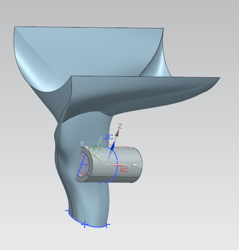
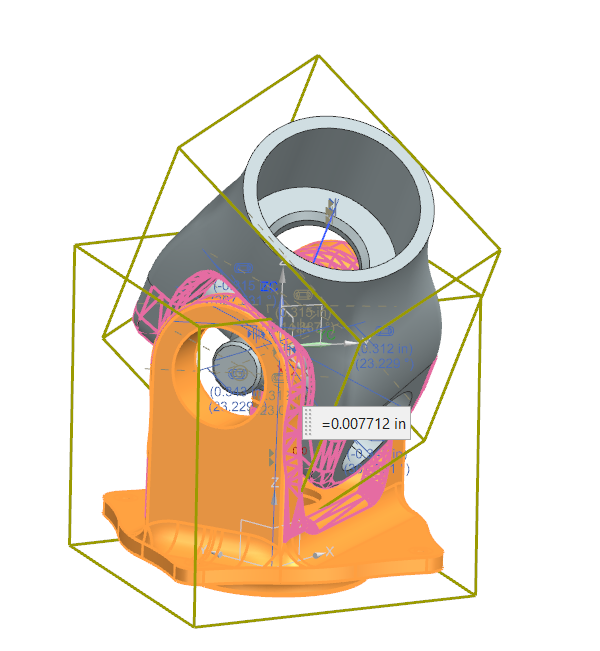

<h2> Design Work</h2>

  

    
    
 SR25 kicking up some dust! Shot by me at Baja SAE Arizona. 
  
  

  

 In my second year on the team, I focused primarily on designing drivetrain components. I designed the universal joints that interface with the gearbox to transmit torque to the load-bearing rear half-shafts, as well as the front spindle yoke that interfaces with the wheel. In doing so, I utilized Siemens NX to design the CAD models of the parts, as well as Ansys to analyize the different parts. 

  

    
    
 Gearbox u-joint, Mark I. 
  
  

  

    
    
 The gearbox u-joints won't collide B) 
  
  

