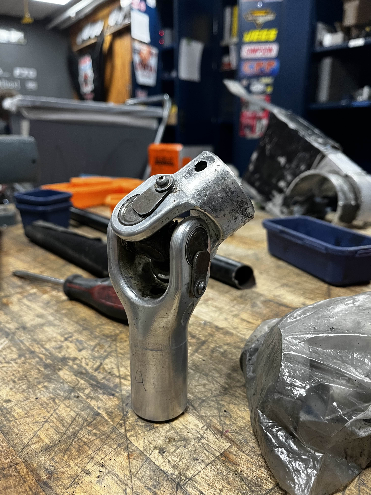

At Case Western Reserve University, I spend a lot of my time with CWRU Motorsports (or "Baja"). On the team, I design and manufacture car components, and am currently serving as the CAD Onboarding Lead and the Cost Report Coordinator. Our team competes in the <a title="Baja SAE" href="bajasae.net">Baja SAE collegiate racing series</a>- a series that challenges teams to design, build, and compete with an off-road racing vehicle. To learn more about the team, visit <a title="CWRU Motorsports" href="https://cwrumotorsports.com/">our website</a>.

<h2>Design Work</h2>

In my first year on the team, I focused primarily on designing drivetrain components. I designed the universal joints for the front and rear driveshafts and worked on the load-bearing rear half-shaft. In doing so, I utilized Solidworks to design the CAD models of the parts. I learned from upperclassmen how to apply the knowledge from academic coursework about stress and strain to analysis of the components I designed, and learned to use Ansys to perform finite element analysis (FEA) on the yoke pair, both on the part-level and the assembly-level.

This project was challenged me in many ways, but I've come away from it knowing so much more about the car, design tools, and how to properly analyze parts and components within the context of larger assemblies. As I return to this project for the upcoming year, I'm looking forward to applying all that I've learned to redesign the parts to fit with our new suspension geometry while also being easier to assemble and cheaper for our team.

  

    
    
 Solidworks model of the front yoke pair of SR24. 
  
  

  
  

    
    
 Assembly-level FEA of front yoke pair of SR24. 
  
  

  
  

    
    
 Assembled front yoke pair of SR24. 
  
  

<h2>Leadership</h2>

<strong>CAD Onboarding</strong> <strong>Lead: </strong>At the end of my freshmen year on the team, I was looking forward to the upcoming season with a sense of trepidation. Over the past few years, CWRU Motorsports has gained many new members in a very short amount of time. Though team veterans were very welcoming and sought to bring in interested rookies, the team simply didn't have the infrastructure to support the unprecedented number of prospective members, and the impact of these growing pains was especially evident to me as a first-year student.

Over the summer, I started a new initiative to lower the barrier of entry for the team by offering incoming team members the opportunity to learn how to CAD. I worked with the Membership Lead to coordinate our efforts to improve the onboarding experience and to build the infrastructure to continue to support team growth. I developed a 6-week CAD curriculum to teach the students good drawing/drafting standards and how to model and assemble using our team's CAD software (Siemens NX). This semester, over 50 students signed up to attend these sessions, and I am hopeful that CWRU Motorsports will be able to continue to grow and improve with this new generation.&nbsp;

<strong>Cost Report Coordinator: </strong>The Cost Events are part of the Baja SAE competition in the "Static Events" category. These events occur before dynamic events (such as timed acceleration runs), but are still impactful to the team score. As Cost Report Coordinator, I organize the team's efforts to reduce the cost of our car through the Baja SAE Cost Reporting system and to create the Cost Reduction Report. In this role, I've utilized Excel to analyze our car's budget and look for ways to optimize and reduce the cost of materials, processes, and assemblies.

